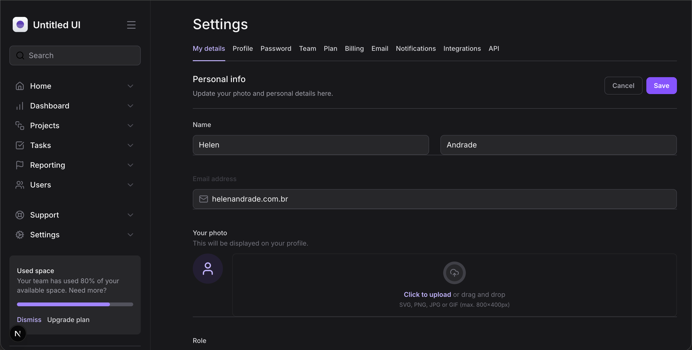
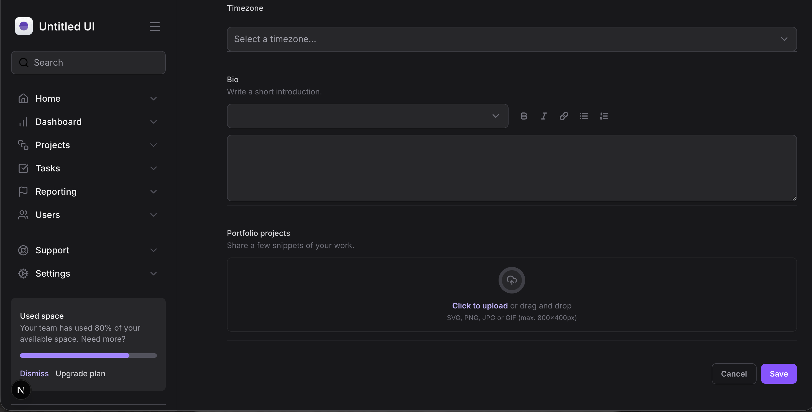

# Masterizando Tailwind

Este é um projeto desenvolvido como desafio prático para reforçar conceitos fundamentais do Tailwind e ReactJs

    
    

# Funcionalidades

- Página de formulário

- Input de busca

- Menu de navegação

- Perfil de usuário

- Listagem de arquivos

# Conceitos abordados

- Responsividade

- Seletores e estado

- Valores arbitrários

- Animações

- Variantes

# Como utilizar

1- Clone o projeto
`git@github.com:helen-andrade/tailwind-next.git`

2- Instale as dependências
`pnpm i`

3- Rode o script de desenvolvimento
`pnpm dev`

---

    
Feito com ♡ por Helen Andrade

